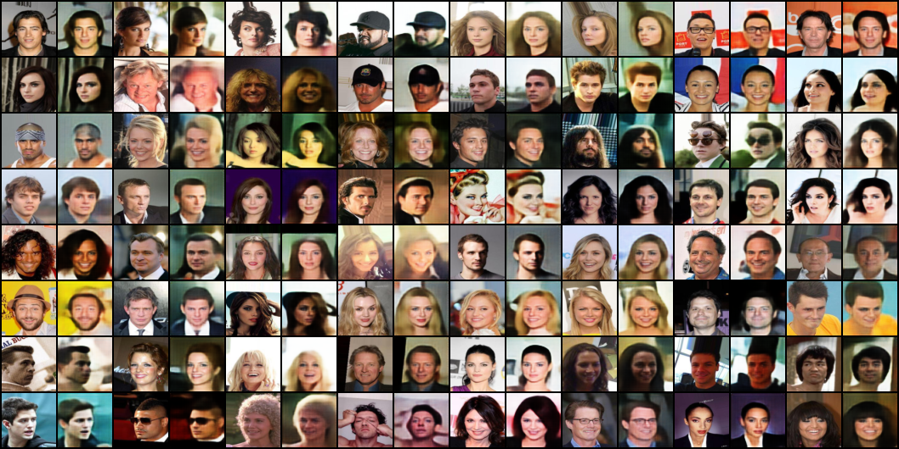

## Autoencoder implementation in PyTorch. 

Currently trainer supports only the [celebA](http://mmlab.ie.cuhk.edu.hk/projects/CelebA.html) dataset.

## **Requirements**
- PyTorch v0.4.0
- torchvision
- tqdm
- tensorboard_logger

## **Comments and Implementation Details**:
- I performed all experiments over the aligned images in celebA.
- There are three parameters used to split the celebA: `red_ratio` can be used to reduce training set size in order to tune hyperparameters quickly, `test_split` determines the ratio between training and test splits, `validation_split` determines how much of the training set will be used as the validation set.
- To run on CPU or GPU supporting the cuda, set *device* argument to *'cpu'* or *'cuda'* respectively.
- Don't forget to arange folders for `exp_dir` and `data_dir`. `data_dir` is assumed to point /some_path/celebA/img_align_celeba.

## **Sample Reconstructions**:
The image below depicts some reconstructions from the test set. While I was experimenting with several random reconstructions, I realized that the model only cares about face and hair. The network learns to delete, for instance, hands or necklaces.

## **Interpolation between two images**:
Interpolations in the latent codes of two images. Top and bottom rows show the weighted averages
of the original images and the reconstructions of interpolated latent codes, respectively.

## **Interpolation over the dimensions**:
In order to see how each dimension effects the reconstructed image, I made some sequential tiny changes to each dimension separetely and reconstructed the latent code. In the image below, middle column is the original image, and each row represents changes over a dimension (top:0th dimension, bottom:127th dimension). As you go left and right 
in each step 0.2 is subtracted and added to the corresponding dimension, respectively.

When you look at each row carefully, you can see that small changes over each dimension changes the appearance of 
the lady.

